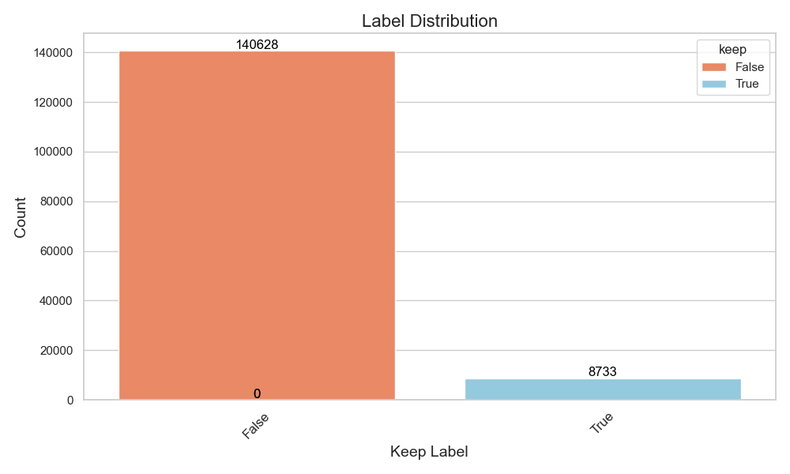
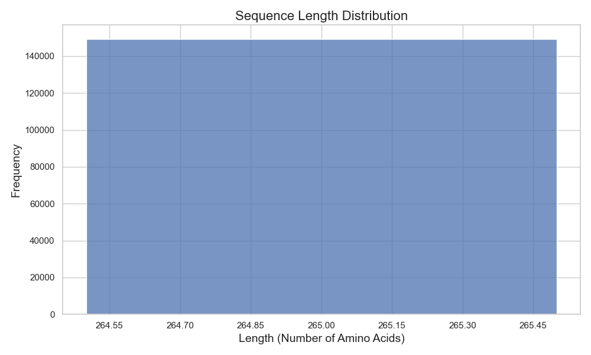

## GB1 Dataset Description
This dataset focuses on mutations at specific sites (V39, D40, G41, V54) of the GB1 protein, with an emphasis on the impact of these mutations. The fitness score of each mutation is normalized to facilitate analysis.

### Biological Context
GB1, a domain of Protein G from Streptococcus, is widely used in studies of protein folding and stability. The mutation sites V39, D40, G41, and V54 are key to its structural and functional properties, making them critical for understanding the protein's behavior under mutational changes.

*Figure 1: 3D structure of the GB1 protein. The mutation sites V39, D40, G41, and V54 are highlighted. (source: https://www.rcsb.org/structure/5LDE)*

## Visualizations and Interpretations

### Label Distribution ('Keep' Key)

*Figure 2: Distribution of 'keep' labels in the dataset. The label indicates whether a variant is to be retained ('true') or discarded ('false') based on certain criteria, providing insights into the viability of mutations.*

### Normalized Score Distribution

*Figure 3: Distribution of normalized fitness scores. Linear normalization scales the scores between 0 and 1, making them comparable across different mutations.*

### Sequence Length Distribution

*Figure 4: Distribution of sequence lengths. GB1 sequences maintain a constant length of 265 amino acids.*

### Number of Mutations Distribution

*Figure 5: Count of mutations in each mutation mask. This visualization shows the number of mutations present in different protein variants.*

### Mutation Heatmap

*Figure 6: Heatmap displaying mutations across the sequences. The '+' symbol represents insertions, and '-' represents deletions, highlighting the nature and location of mutations.*

## Score Interpretation
Normalized fitness scores range from 0 (least fit) to 1 (most fit), indicating the potential impact of each mutation on GB1's functionality. Higher scores suggest mutations that either enhance or do not significantly impair the protein's functionality, a key aspect for biotechnological applications.
