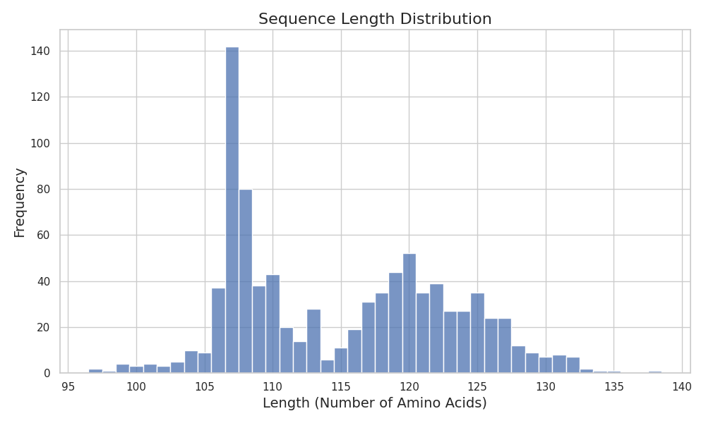
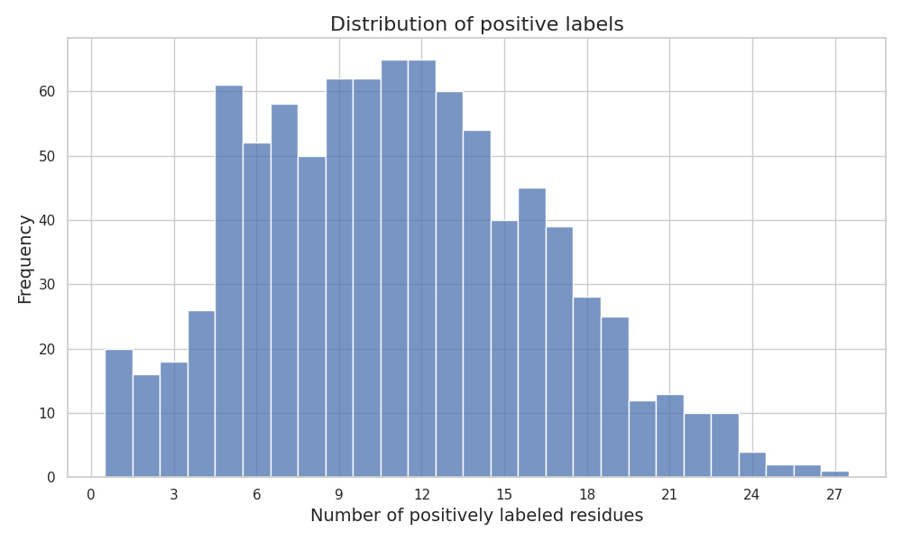

## Paratope Dataset Description
This dataset is a selection of sequences from the SabDab database. The dataset can be found here: https://github.com/alchemab/antiberta/tree/master/assets

### Biological Context
The paratope is the part of the antibody sequence that binds to an epitope on an antigen. Each residue of the antibody sequence is labeled either as being part of the paratope or not being part of the paratope.

### Sequence Length Distribution

*Figure 1: Distribution of sequence lengths. This plot helps in understanding the range of protein sizes in the dataset and filtering out extreme cases.*

### Token Label Distribution

*Figure 2: Distribution the number of residues labeled as paratope positions in each sequences.*