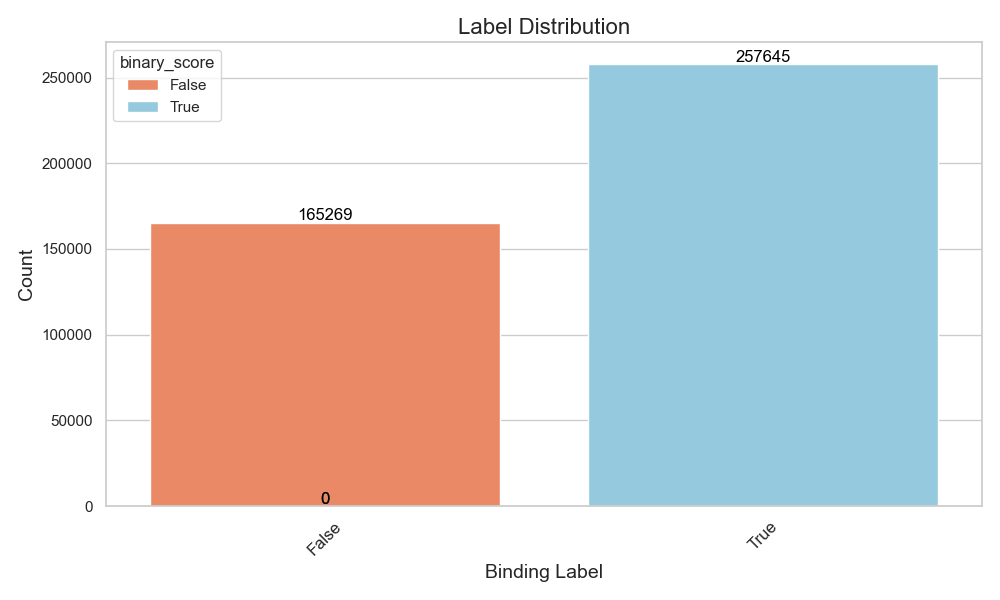

## RBD Dataset Description

### Biological Context

## Visualizations and Interpretations

### Label Distribution

*Figure 1: Distribution of the labels in the dataset for assessing class imbalance. Label corresponds to binding of ACE2 by the RBD sequence.*

### Number of Mutations Distribution

*Figure 2: Frequency distribution of the number of mutations.*

### Mutation Heatmap

*Figure 3: Heatmap showing the distribution of mutations across positions for each amino acid.*
