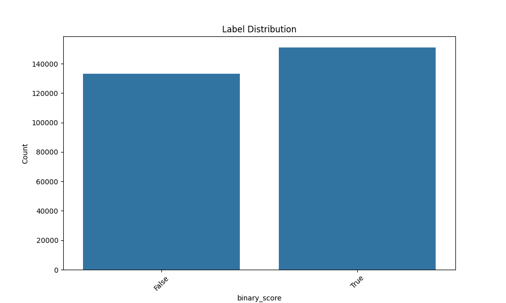
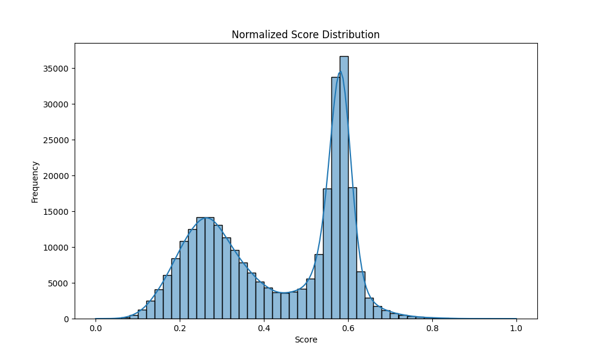

## Dataset Description
The dataset includes mutations in the region [561, 588] and the fitness score is normalized.

## Visualizations
The following visualizations are generated:

### Label Distribution

*Binary score is used as label*

### Normalized Score Distribution

*Linear normalization used*

### Sequence Length Distribution

*Not much to write*

### Number of Mutations Distribution

*How many mutations exist in each mutation mask*

### Mutation Heatmap

*+ for insertions, - for deletions. Seems legit*