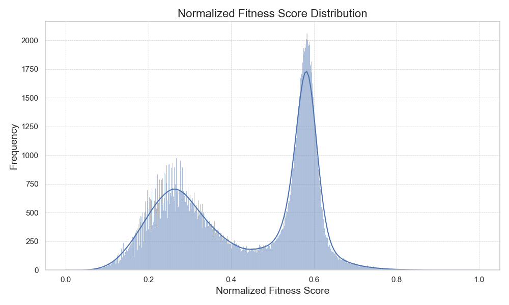

## AAV Dataset Description
The dataset focuses on mutations within the region [561, 588] of the Adeno-Associated Virus (AAV) and includes fitness scores for these mutations. The fitness score quantifies the impact of mutations on the virus's function and is normalized for better comparability and analysis.

### Biological Context
Adeno-Associated Virus (AAV) is a small virus that infects humans and some other primate species. It is widely used as a vector for gene therapy due to its low pathogenicity and stable gene delivery. The region [561, 588] is crucial for its capsid protein structure, influencing the virus's ability to deliver genetic material effectively.

*Figure 1: Structure of Adeno-Associated Virus. (source:https://www.rcsb.org/structure/5IPI)*

## Visualizations and Interpretations

### Label Distribution

*Figure 2: Distribution of binary scores in the dataset. The binary score is used as a label to represent the presence (1) or absence (0) of specific mutations.*

### Normalized Score Distribution

*Figure 3: Distribution of normalized fitness scores. Linear normalization is applied to bring scores to a 0-1 range, facilitating easier comparison across variants.*

### Sequence Length Distribution

*Figure 4: Length distribution of AAV sequences. This plot reflects the uniformity or variability in the lengths of the sequences studied.*

### Number of Mutations Distribution

*Figure 5: Frequency distribution of the number of mutations per mutation mask. It indicates how many mutations are typically present in the sequences.*

### Mutation Heatmap

*Figure 6: Heatmap showing the distribution of mutations across sequences. '+' marks represent insertions, and '-' marks represent deletions, providing insight into mutation patterns.*

## Score Interpretation
The normalized fitness score ranges from 0 to 1, where a higher score indicates a mutation that potentially has a more significant impact on the AAV's fitness. This score is a critical factor in understanding the effectiveness of different AAV variants, especially in the context of gene therapy applications.
